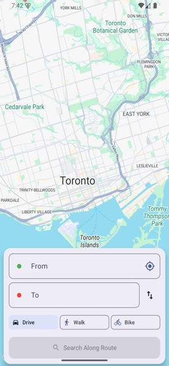

# OnRoute

Find places along your route, ranked by how little time they add.

Enter origin, destination, and what you're looking for — coffee, dinner pickup, gas — and see options sorted by "+X minutes" of detour.

**[Landing Page](https://onroute-landing.vercel.app)** · **[iOS TestFlight](https://testflight.apple.com/join/jp77yU4e)** · **[iOS Firebase](https://appdistribution.firebase.dev/i/4585dac30b5a8ccd)** · **[Android](https://appdistribution.firebase.dev/i/47c1cf7b6ee71c85)**

<p align="center">
  
  &nbsp;&nbsp;&nbsp;
  
</p>

## The Problem

Google Maps shows you what's nearby. OnRoute shows you what's worth the stop.

No existing app makes detour time the primary ranking across all POI categories. Google Maps has "search along route" but buries it, doesn't sort by detour time, and has no max-detour filter. Waze limits you to one stop and shows results behind you. Apple Maps has no route-aware search at all.

## Features

- **Detour-ranked results** — every result shows "+X min" added to your trip
- **Max-detour slider** — "only show places adding less than 5 minutes"
- **Forward-only** — never shows places behind you on the route
- **Category search** — coffee, food, gas, grocery, pharmacy, EV charging
- **Travel modes** — drive, walk, or bike
- **Detour preview** — tap a result to see the A→B→C route on the map with waypoint markers
- **Navigation handoff** — open the route in Google Maps, Apple Maps, or Waze
- **Works globally** — not limited to any city
- **Dark mode** — full support on both platforms
- **Accessibility** — VoiceOver (iOS) and TalkBack (Android) labels

## Tech Stack

| Layer | Choice |
|---|---|
| **iOS** | SwiftUI + MapKit |
| **Android** | Jetpack Compose + Google Maps SDK |
| **Backend** | Vercel Functions (TypeScript) |
| **Routing** | Google Routes API |
| **Places** | Google Places Text Search (Search Along Route) |
| **iOS** | SwiftUI + MapKit |
| **Android Beta** | Firebase App Distribution |

All routing/POI logic lives server-side. Native apps are thin clients that render routes and markers. Backend includes rate limiting (20 req/min per IP), CORS restriction, input validation, and in-memory caching (1hr TTL).

## Project Structure

```
ios/                 SwiftUI app (XcodeGen project)
android/             Jetpack Compose app (Gradle Kotlin DSL)
backend/             Vercel Functions API (TypeScript)
landing-page/        Marketing site (static HTML, Vercel)
docs/                Research, competitive analysis, product strategy
```

## URLs

| What | URL |
|---|---|
| Backend API | https://backend-navy-iota.vercel.app |
| Landing Page | https://onroute-landing.vercel.app |
| iOS TestFlight | https://testflight.apple.com/join/jp77yU4e |
| iOS Firebase | https://appdistribution.firebase.dev/i/4585dac30b5a8ccd |
| Android Firebase | https://appdistribution.firebase.dev/i/47c1cf7b6ee71c85 |
| Firebase Console | https://console.firebase.google.com/project/onroute-akm-2026 |

## Development

### Backend
```bash
cd backend
npm install
cp .env.example .env  # add GOOGLE_MAPS_API_KEY
npx vercel dev
```

### iOS
```bash
cd ios
brew install xcodegen
xcodegen generate
open Detour.xcodeproj
```

### Android
```bash
cd android
cp local.defaults.properties secrets.properties  # add MAPS_API_KEY
./gradlew assembleDebug
```

## API

`POST /api/search`

```json
{
  "origin": { "lat": 43.77, "lng": -79.26 },
  "destination": { "lat": 43.65, "lng": -79.38 },
  "query": "coffee",
  "travelMode": "DRIVE",
  "maxDetourMinutes": 15,
  "openNow": true
}
```

Returns POIs ranked by detour time with route polyline. Supports `travelMode`: `"DRIVE"`, `"WALK"`, `"BICYCLE"`.

## Release Notes

See [CHANGELOG.md](CHANGELOG.md) for full release history.
